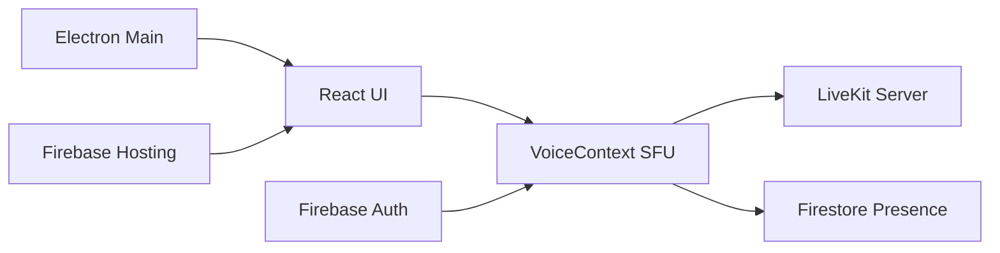
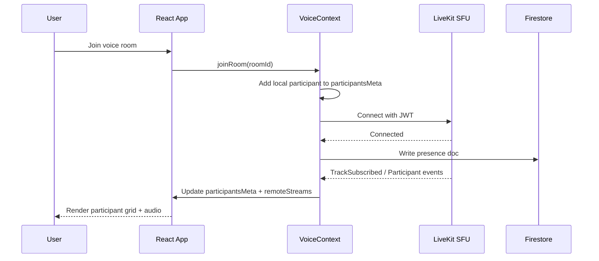
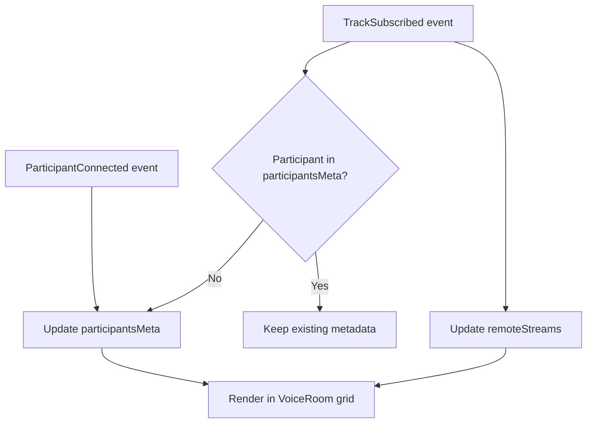
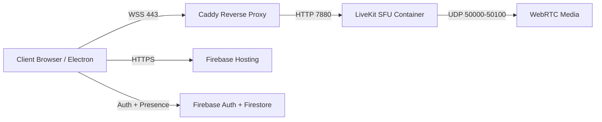

# Cruwells Vox

Real-time voice collaboration platform powered by LiveKit SFU, Firebase, React, and Electron.

## Overview

Cruwells Vox provides low-latency, multi-user voice rooms with:

- SFU-based audio distribution (not mesh)
- real-time participant presence
- speaking detection and visual state
- web deployment and desktop packaging

Primary targets:

- Web app: Firebase Hosting
- Desktop app: macOS DMG and Windows NSIS/portable via Electron

## Core Features

- LiveKit SFU integration for scalable voice rooms
- Firebase authentication and Firestore presence tracking
- participant grid + sidebar synchronization
- per-user volume controls
- speaking detection with Web Audio API analysis
- desktop runtime via Electron

## Architecture



### Join Room Flow



### Presence and Rendering Logic



## Tech Stack

- Frontend: React + Vite
- Voice SFU: LiveKit
- Backend services: Firebase Auth, Firestore, Functions
- Desktop: Electron + electron-builder
- CI/CD: GitHub Actions

## Project Structure

```text
src/
	components/        # UI components
	contexts/          # Auth + Voice contexts
	hooks/             # Messaging, speaking, participants hooks
	electron/          # Electron main/preload sources
public/
	logo.png           # runtime/dev app icon
	logo.ico           # Windows installer icon
	icon.icns          # macOS bundle icon
functions/           # Firebase functions backend
```

## Local Development

### Prerequisites

- Node.js 20+
- npm 10+
- Firebase CLI

### Install

```bash
npm install
```

### Run Web App

```bash
npm run dev
```

### Run Electron App (Dev)

```bash
npm run dev:electron
```

## Build and Release

### Web Build

```bash
npm run build:web
```

### Desktop Builds

```bash
npm run build:electron:mac
npm run build:electron:win
```

Artifacts are generated under `release/`.

## Environment Variables

Create `.env.local` for development values:

```bash
VITE_FIREBASE_API_KEY=
VITE_FIREBASE_AUTH_DOMAIN=
VITE_FIREBASE_PROJECT_ID=
VITE_FIREBASE_STORAGE_BUCKET=
VITE_FIREBASE_MESSAGING_SENDER_ID=
VITE_FIREBASE_APP_ID=
VITE_LIVEKIT_URL=
```

## Deployment

### Production Infrastructure (Oracle Cloud)

Voice SFU is hosted on Oracle Cloud and exposed over secure WebSocket.

- Cloud: Oracle Cloud Infrastructure (OCI)
- SFU host: LiveKit (Docker)
- Reverse proxy: Caddy (TLS termination + WSS)
- Public endpoint: `wss://130-61-146-31.nip.io`
- Web app hosting: Firebase Hosting (`https://cruwellsvox.web.app`)



#### OCI Network Notes

- Open TCP: `22`, `80`, `443`, `7880`
- Open UDP: `50000-50100` (LiveKit RTC media)
- Ensure iptables/NSG rules allow both inbound and return traffic for RTP/RTCP flows

### Firebase Hosting

```bash
npm run build:web
firebase deploy --only hosting
```

Current hosting URL:

- https://cruwellsvox.web.app

### GitHub Releases (Desktop)

Release workflow is tag-driven.

```bash
git tag v0.1.0
git push origin v0.1.0
```

GitHub Actions will build installers and attach them to the release.

### GitHub Actions Secrets

Add this repository secret for web deploy workflow:

- `FIREBASE_SERVICE_ACCOUNT_CRUWELL_S_VOX`

## Security and Ops Notes

- Do not commit `.env` files.
- Keep Firebase rules audited and versioned.
- Keep LiveKit API key/secret only in secure environments.

## Contributing

See [CONTRIBUTING.md](CONTRIBUTING.md) for full contribution guidelines.

